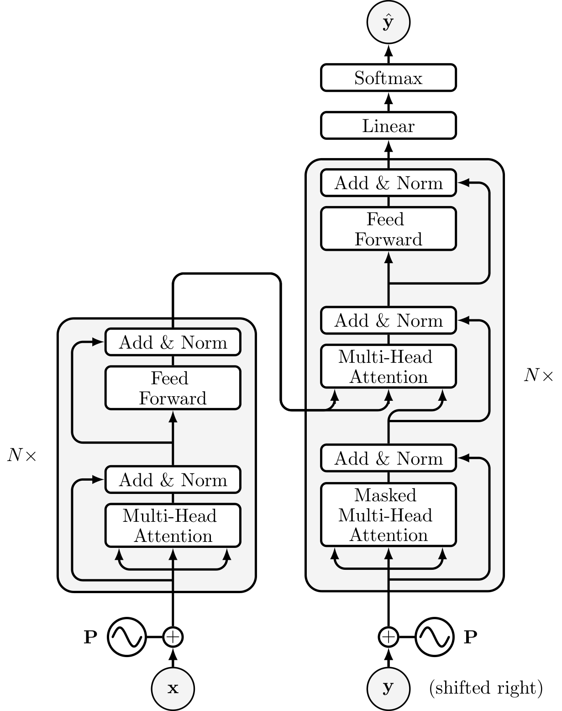
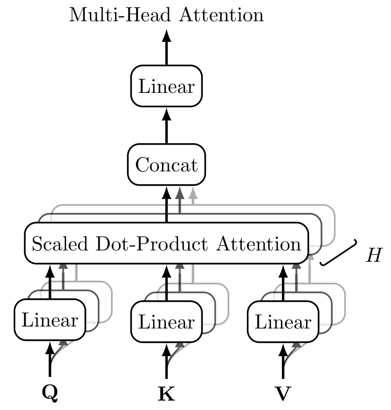
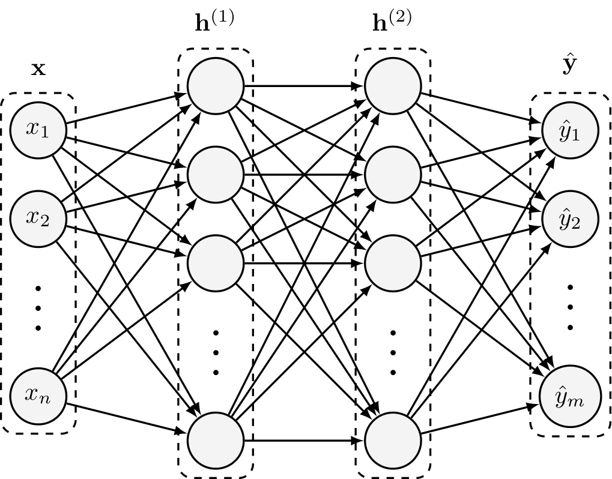

# NNTikZ

A collection of TikZ diagrams for neural network and deep learning concepts. This repository was created to provide a set of open-source diagrams for use in academic papers and presentations.

If you use this repository in your research or project, please cite it as follows:
```
@misc{love2024nntikz,
    author = {Fraser Love},
    title = {NNTikZ - TikZ Diagrams for Deep Learning and Neural Networks},
    year = 2024,
    url = {https://github.com/fraserlove/nntikz},
    note = {GitHub repository}
}
```

See some examples below:

#### Transformer - [Vaswani et al. (2017)](https://arxiv.org/abs/1706.03762)


#### Multi-Head Attention - [Vaswani et al. (2017)](https://arxiv.org/abs/1706.03762)


#### Neural Network


#### Attention Mechanism - [Bahdanau et al. (2014)](https://arxiv.org/abs/1409.0473)


#### Gated Recurrent Unit (GRU) - [Cho et al. (2014)](https://arxiv.org/abs/1406.1078)


#### RNN Encoder-Decoder - [Sutskever et al. (2014)](https://arxiv.org/abs/1409.3215)


#### Backpropagation Through Time (BPTT) - [Werbos (1990)](https://www.researchgate.net/publication/220365479_Backpropagation_through_time)

