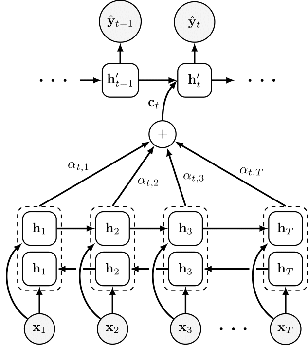
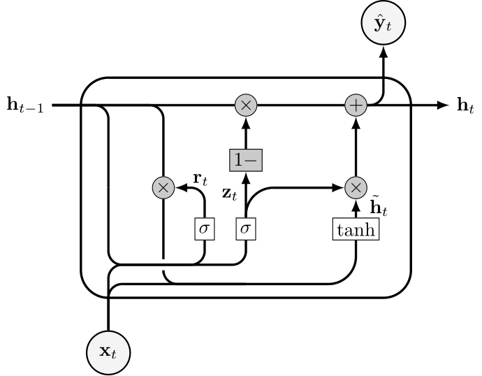
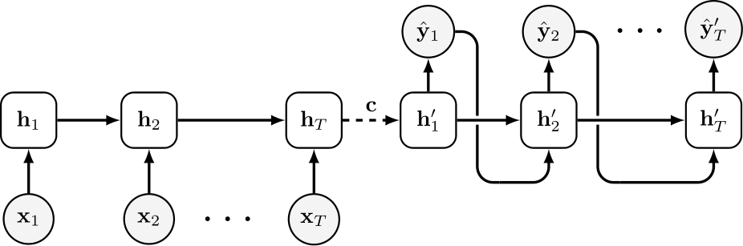
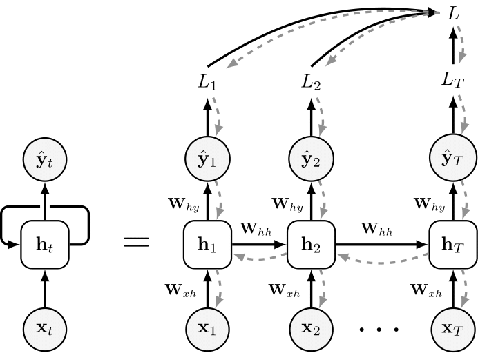

# Deep Learning and Neural Network Diagrams

A collection of TikZ diagrams for deep learning and neural network concepts. This repository was created to provide a set of open-source diagrams for use in academic papers, presentations, and other documents. The diagrams are designed to be easily customisable and can be used in LaTeX documents. Note that this repository is a work in progress and more diagrams will be added over time.

## Examples

#### Attention Mechanism - [Bahdanau et al. (2014)](https://arxiv.org/abs/1409.0473)


#### Gated Recurrent Unit (GRU) - [Cho et al. (2014)](https://arxiv.org/abs/1406.1078)


#### Sequence-to-Sequence Model - [Sutskever et al. (2014)](https://arxiv.org/abs/1409.3215) and [Cho et al. (2014)](https://arxiv.org/abs/1406.1078)


#### Backpropagation Through Time (BPTT) - [Werbos (1990)](https://www.researchgate.net/publication/220365479_Backpropagation_through_time)


## Citation

If you use this repository in your research or project, please cite it as follows:
```
@misc{love2024nntikz,
    author = {Fraser Love},
    title = {TikZ Diagrams for Deep Learning and Neural Networks},
    year = 2024,
    url = {https://github.com/fraserlove/nntikz},
    note = {GitHub repository}
}
```